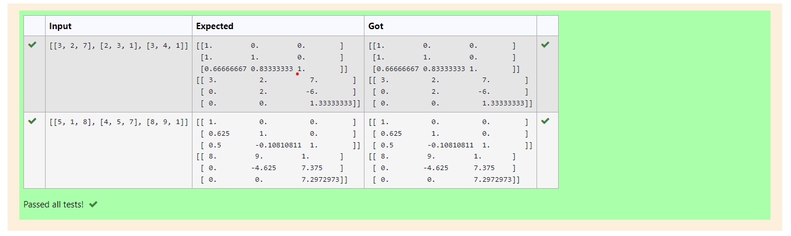
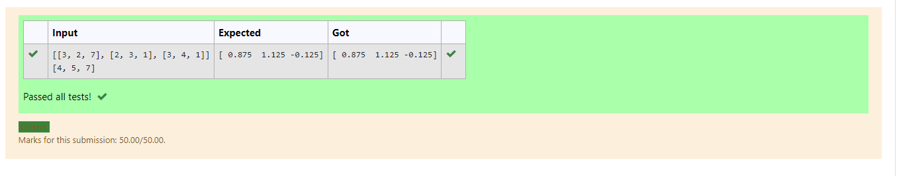

# LU Decomposition without zero on the diagonal

## AIM:
To write a program to find the LU Decomposition of a matrix.

## Equipments Required:
1. Hardware – PCs
2. Anaconda – Python 3.7 Installation / Moodle-Code Runner

## Algorithm
1. Use LU Decomposition to solve a matrix.
2. From scipy package import lu().
3. Get input from user and pass it as an array.
4. Get P, L U martix using lu().
5. Print L and U matrix.


## Program:
```
'''Program to find L and U matrix using LU decomposition.
Developed by: Senthil Kumar S
RegisterNumber: 21500410
'''

# To print L and U matrix
import numpy as np
from scipy.linalg import lu
# import scipy.linalg
a=np.array(eval(input()))
p,l,u=lu(a)
# p,l,u=scipy.linalg.lu(a)
print(l)
print(u)

```

## Output:



## Result:
Thus the program to find the LU Decomposition of a matrix is written and verified using python programming.


# Use LU Decomposition to solve a matrix

## AIM:
To write a program to find the LU Decomposition of a matrix.

## Equipments Required:
1. Hardware – PCs
2. Anaconda – Python 3.7 Installation / Moodle-Code Runner

## Algorithm
1. Import numpy library using import statement.
2. From scipy package import lu_factor() and lu_solve().
3. Get two inputs from user and pass it as ,matrux array.
4. Find lu and pivot value of first marix using lu_factor().
5. Find solution of the matrix by using lu_solve() and pass
   lu, pivot values and second matrix as arguments.
6. Print the solution.

## Program:
```
'''Program to find L and U matrix using LU decomposition.
Developed by: Senthil Kumar S
RegisterNumber: 21500410
'''

# To print X matrix (solution to the equations)
import numpy as np
from scipy.linalg import lu_factor,lu_solve
a=np.array(eval(input()))
b=np.array(eval(input()))
lu,pivot=lu_factor(a)
x=lu_solve((lu,pivot),b)
print(x)
```

## Output:



## Result:
Thus, the program to find the LU Decomposition of a matrix is written and verified using python programming